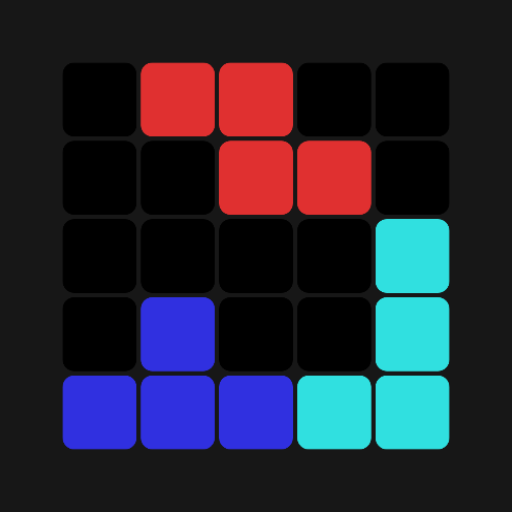

<!--suppress ALL -->


<div align="center">
    
    <h1>Tetramine</h1>
    <h3>The mobile modern version of tetris</h3>
</div>

<div align="center">
    <div style="display: flex; flex-direction: row;">
        <a href='https://github.com/JustDeax/Tetramine/releases'></a>
    </div>
</div>

**This is the mobile modern version of tetris**

Classic arcade puzzle game where you have to stack falling tetromino — 4-block pieces, create solid lines out of them and play for the score
The original mechanics are retained here, with smooth controls, but with a modern, minimalist design

```
This is a semi-open source project at the moment
- My position: I'm not ready to post the whole code of this game at the moment.
- You can also send bugs, wishes, improvements through “issues”.
```

### Feature
- [ ] Modern Material Design 3 And ViewModel
- [ ] Comfortable control setup
- [ ] Fair distribution of "7-bag" figures
- [ ] Hard drop and soft drop
- [ ] Cool Rotation System (when rotating, the figure can be shifted to get into the right holes)
- [ ] Advanced scoring system (not including t-spin yet)
- [ ] Ghost figure
- [ ] Powerful action notification (4 lines, combos and so on)
- [ ] Dynamic Theme support

### TODO
- [ ] Detailed statistics
- [ ] Full customization of controls and appearance
- [ ] Multiple game modes
- [ ] Rotate both ways
