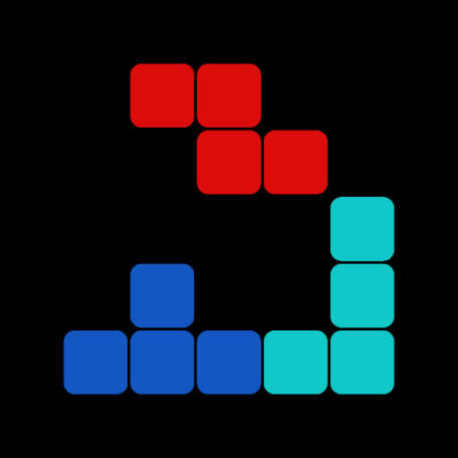

<!--suppress ALL -->


<div align="center">
    
    <h1>Tetramine</h1>
    <h3>The mobile modern version of tetris</h3>
</div>

<div align="center">
    <div style="display: flex; flex-direction: row;">
        <a href='https://github.com/JustDeax/Tetramine/releases'></a>
    </div>
</div>

**This is the mobile modern version of tetris**

Classic arcade puzzle game where you have to stack falling tetromino — 4-block pieces, create solid lines out of them and play for the score
The original mechanics are retained here, with smooth controls, but with a modern, minimalist design

```
This is a semi-open (70% open) source project at the moment
- My position: I'm not ready to post the whole code of this game at the moment.
- You can also send bugs, wishes, improvements through “issues”.
```

### Feature
- [ ] Modern Material Design 3 And ViewModel
- [ ] Comfortable control setup
- [ ] Fair distribution of "7-bag" figures
- [ ] Hard drop and soft drop
- [ ] Cool Rotation System [What is](#cool-rotation-system)
- [ ] Advanced Scoring System [What is](#advanced-scoring-system)
- [ ] Ghost figure
- [ ] Powerful action notification [What is](#powerful-action-notification)
- [ ] Dynamic Theme support
- [ ] Detailed statistics

### TODO
- [ ] Full customization of controls and appearance
- [ ] Multiple game modes
- [ ] Rotate both ways

### Cool Rotation System
When a piece can't rotate in place, it tries to shift sideways to complete the rotation.
A list of offsets is used to find a valid position.
```kotlin
val kickOffsets = listOf(
            0 to 0,
            0 to 1,
            0 to -1,
            1 to 0,
            1 to 1,
            1 to -1,
            2 to 0,
            2 to 1,
            2 to -1
 )
```
 
### Advanced Scoring System
Earn more points by clearing multiple lines at once or performing complex moves
```
object AddScore {
    const val ONE = 1
    const val TWO = 2
    const val COMBO = 50
    const val SINGLE = 100
    const val DOUBLE = 300
    const val TRIPLE = 500
    const val TETRAMINE = 800
    const val T_SPIN_SINGLE = 800
    const val T_SPIN_DOUBLE = 1200
    const val PERFECT_CLEAR = 1800
}
```

### Powerful action notification
The top of the screen will show the best actions (Gives the most points).
- Back to back
- 4 cleared lines
- T Spin Double
- Perfect Clearance
- Combo x3, 5, 7
to keep them out of the way, they'll stop appearing above level 10.
